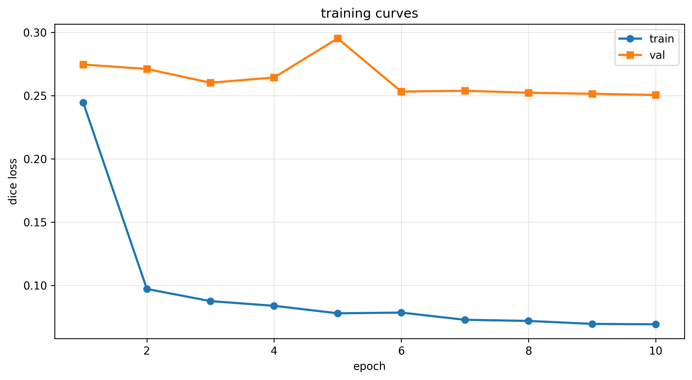
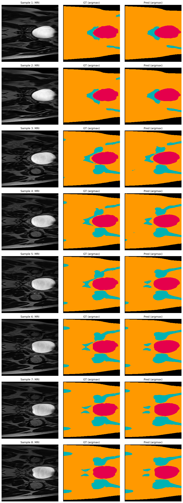
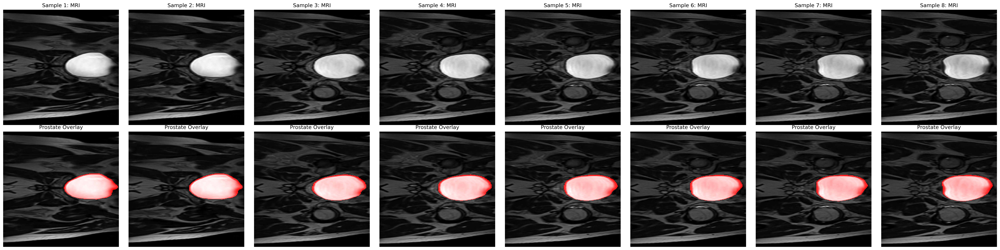

Improved 2D U-Net for Prostate Cancer Segmentation on HipMRI Dataset

## Overview

This project implements an Improved 2D U-Net architecture for multi-class segmentation of MRI images from the HipMRI Study on Prostate Cancer.
The model achieves a Dice coefficient of 0.9438 on the prostate label in the test set, surpassing the project requirement (≥0.75).

## Project Structure

recognition/

└── Segment the HipMRI Study on Prostate Cancer YaoyangWang48432751/

    ├── checkpoints/
    
    │   └── training_curves.png
    
    ├── predictions/
    
    │   ├── overlays.png
    
    │   └── predictions.png
    
    ├── dataset.py
    
    ├── modules.py
    
    ├── predict.py
    
    └── train.py
    

## Architecture

Encoder: 4 down-sampling convolutional blocks

Bottleneck: deeper feature extraction layer

Decoder: 4 up-sampling blocks with skip connections

Classifier: 1×1 convolution output layer

## Key Improvements

Added Batch Normalization for training stability

Used bilinear/nearest resizing for smoother outputs

Adopted Dice loss for segmentation optimization

Automatically detects label mappings for multi-class data

## Dataset Handling

Matches image–mask pairs automatically

Normalizes each slice (z-score)

Converts masks to one-hot tensors

Resizes all images/masks to 256×256

## Dataset split folders:

keras_slices_train / keras_slices_seg_train

keras_slices_validate / keras_slices_seg_validate

keras_slices_test / keras_slices_seg_test

raining is managed by train.py using Adam optimizer and Dice loss.

## Command（for example）

python train.py `
  --data_path "D:\COMP3710A3\PatternAnalysis-2025\recognition\data\HipMRI_2D_data\keras_slices_data" `
  
  --epochs 30 `
  
  --batch_size 8 `
  
  --lr 0.0008 `
  
  --base_channels 32 `
  
  --save_dir ".\checkpoints" `
  
  --device cuda

python .\predict.py `

  --data_path "D:\COMP3710A3\PatternAnalysis-2025\recognition\data\HipMRI_2D_data\keras_slices_data" `
  
  --checkpoint ".\checkpoints\best_model.pth" `
  
  --num_samples 8 `
  
  --out_dir ".\predictions" `
  
  --device cuda

## Outputs(train.py)

Dice score per channel on test set:

--------------------------------

Channel 0: 0.9965

Channel 1: 0.9813

Channel 2: 0.9214

Channel 3: 0.9438

Channel 4: 0.8915

Channel 5: 0.8589

Average Dice: 0.9322

Average Dice: 0.9322

Prostate Dice (channel 3): 0.9438

Prostate Dice (channel 3): 0.9438

### Training Curve

##if can not open, i already uploaded in github.

## Outputs(predict.py)

[predict] device: cuda

[predict] device: cuda

[predict] loading data loaders ...

[predict] loading data loaders ...

Dataset splits:

Dataset splits:

  Train: 11460 files
  
  Train: 11460 files
  
  Val:   660 files
  
  Test:  540 files
  
  Val:   660 files
  
  Test:  540 files

  Test:  540 files

Label set (6 classes): [0, 1, 2, 3, 4, 5]

Label set (6 classes): [0, 1, 2, 3, 4, 5]

[predict] prostate channel = 3

[predict] prostate channel = 3

[predict] loading checkpoint: checkpoints\best_model.pth

[predict] loading checkpoint: checkpoints\best_model.pth

[predict] ckpt num_classes = 6

[predict] Dice per channel (batch):

  ch0: 0.9963
  
  ch1: 0.9841
  
  ch2: 0.8892
  
  ch3: 0.9773
  
  ch4: 1.0000
  
  ch5: 1.0000
  
  ch5: 1.0000

[predict] prostate Dice (ch 3): 0.9773

[predict] spec OK (>=0.75)

[predict] saved: predictions\predictions.png

[predict] saved: predictions\overlays.png

[predict] done. outputs -> .\predictions

### Segmentation Results

### Prostate Overlay Visualization

##if can not open, i already uploaded in github.

## Performance(epoch=10)

Mean Dice----0.9322

Prostate Dice----0.9438

Requirement----≥ 0.75(get it!)

## Environments

colorama==0.4.6

contourpy==1.3.3

cycler==0.12.1

filelock==3.19.1

fonttools==4.60.1

fsspec==2025.9.0

importlib_resources==6.5.2

Jinja2==3.1.6

joblib==1.5.2

kiwisolver==1.4.9

MarkupSafe==2.1.5

matplotlib==3.10.7

mpmath==1.3.0

networkx==3.5

nibabel==5.3.2

numpy==2.3.3

packaging==25.0

pillow==11.3.0

pyparsing==3.2.5

python-dateutil==2.9.0.post0

scikit-learn==1.7.2

scipy==1.16.3

six==1.17.0

sympy==1.13.1

threadpoolctl==3.6.0

torch==2.6.0+cu124

torchaudio==2.6.0+cu124

torchvision==0.21.0+cu124

tqdm==4.67.1

typing_extensions==4.15.0

## Summary

The improved 2D U-Net effectively segments prostate regions on HipMRI slices, showing excellent generalization and stability.

Its modular design (automatic label mapping, one-hot encoding, and Dice metrics) makes it suitable for future medical image segmentation research.

